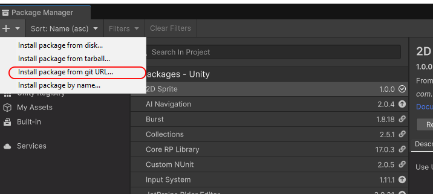
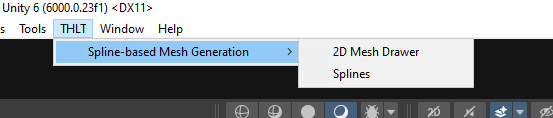

# Spline Based Mesh Generator

## Overview
The **Spline Based Mesh Generator** is a Unity tool that allows you to generate procedural meshes by extending 2D shapes along a Bezier spline. It provides an intuitive editor for defining 2D shapes with control over vertex positions, normals, and UV mapping.

### Key Features
- Generate procedural meshes along Bezier splines.
- Create 2D shapes directly in the Unity editor.
- Define vertex positions, normals, and `u` values for UVs.
- Automatically generate `v` values for UVs along the spline.
- Control UV tiling for precise texture mapping.

## Installation
1. Copy the [Release Link](https://github.com/saaddev96/Spline-Based-Mesh-Generation.git?path=/Assets). 
2. Navigate to Package Manager `Window > Package Manager`.
   1. Click + on the top left .
   3. Click on install package from git url.
      
      
      
   5. Paste the link and click add/install.
      
      
      
3.Done.

 
 
## Usage
### Creating the Spline's Base 2D Shape Using the 2D Mesh Drawer

> ⚠️ **Warning**: The shape's points/vertices must be drawn **clockwise**.

1. **Open the 2D Mesh Drawer**: Navigate to `THLT > Spline-based Mesh Generation > 2D Mesh Drawer` in the Unity Editor.
2. **Create the Shape**: Use the vertex tool to create points that will represent the cross-section of your mesh. Each point represents two vertices.
3. **Define Normals**: Use the normals tool. To define a normal:
   - Click the **Left Mouse Button (LMB)** on a point and drag to set the first vertex's normal.
   - Click a second time to select the other vertex and drag to set its normal.
4. **Check Normals**: Each point has two vertices, each with its own normal. Be careful not to mix up the normals. Scroll down to the target shape, and use the selection tool to check if the normals are set correctly.
5. **Define UVs**:
   - Go to the **Editor** tab.
   - Select a vertex, and the vertex number will appear above. Set the corresponding `U` value.  
   - The `V` values are generated automatically along the spline, but you can control the tiling later in the spline editor.
6. **Shape Creation**: Choose a name for the shape and click **Create**. The shape will be generated as a `ScriptableObject` asset in the `2DMeshes` folder in your project’s Asset directory.

*Preview of the tool in the Unity Editor.*
### Using 2D Shape

1. **Splines Editor**: Navigate to `THLT > Spline-based Mesh Generation > Splines` in the Unity Editor.
2. **Assign the Shape**: Assign the 2D shape you created using the 2D Mesh Drawer to the Mesh 2D field.
3. **Materials**: Each shape is considered a submesh, so you need to assign as many materials as there are shapes, in order.
4. **Spline Drawing**: Navigate to your Scene view. Hold **Left Shift** and click **Left Mouse Button (LMB)** to draw the spline. The object you draw on needs to have colliders in order to be able to draw the spline.
5. **Spline Controls**: You can select control points and use Unity's gizmos to adjust the spline as usual.
6. **Bake**: Once you are satisfied with your spline, you can bake the mesh.

*Preview of the tool in the Unity Editor.*

## Example Applications
- Roads and pathways.
- Rivers or water channels.
- Pipes or tubular structures.
- Custom rails and tracks.

## License
This project is licensed under the MIT License. See [LICENSE](LICENSE) for details.
