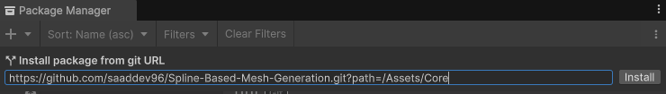

# Spline Based Mesh Generator


## Overview
The **Spline Based Mesh Generator** is a Unity tool that allows you to generate procedural meshes by extending 2D shapes along a Bezier spline. It provides an intuitive editor for defining 2D shapes with control over vertex positions, normals, and UV mapping.


*Preview of the tool in the Unity Editor.*

### Key Features
- Generate procedural meshes along Bezier splines.
- Create 2D shapes directly in the Unity editor.
- Define vertex positions, normals, and `u` values for UVs.
- Automatically generate `v` values for UVs along the spline.
- Control UV tiling for precise texture mapping.

## Installation
1. Copy the link
```bash
https://github.com/saaddev96/Spline-Based-Mesh-Generation.git?path=/Assets/Core
```
4. Navigate to Package Manager `Window > Package Manager`.
   1. Click + on the top left .
   3. Click on install package from git url.
      
      
      
   5. Paste the link and click add/install.
      
      
      
3.Done.

 
 
## Usage
### Creating the Spline's Base 2D Shape Using the 2D Mesh Drawer

> ⚠️ **Warning**: The shape's points/vertices must be drawn **clockwise**.

1. **Open the 2D Mesh Drawer**: Navigate to `THLT > Spline-based Mesh Generation > 2D Mesh Drawer` in the Unity Editor.
2. **Shape Type**: Choose shape type from the drop down.
*Always disable unused shapes to ensure a clean and organized shape creation process.*
4. **Add Shape**: Click the + button to add new shape.
5. **Create the Shape**: Use the vertex tool to create points that will represent the cross-section of your mesh. Each point represents two vertices.

> ⚠️ **Warning**: Make sure to select the target shape before defining the normal , to select just scoll to the shape you want and click on it**.

5. **Define Normals**: Use the normals tool. To define a normal:
   - Click the **Left Mouse Button (LMB)** on a point and drag to set the first vertex's normal.
   - Click a second time to select the other vertex and drag to set its normal.
6. **Check Normals**: Each point has two vertices, each with its own normal. Be careful not to mix up the normals. Scroll down to the target shape, and use the selection tool to check if the normals are set correctly.
7. **Define UVs**:
   - Go to the **Editor** tab.
   - Select a vertex, and the vertex number will appear above. Set the corresponding `U` value.  
   - The `V` values are generated automatically along the spline, but you can control the tiling later in the spline editor.
     
     
     
8. **Shape Creation**: Choose a name for the shape and click **Create**. The shape will be generated as a `ScriptableObject` asset in the `2DMeshes` folder in your project’s Asset directory.


*Preview of the tool in the Unity Editor.*

### Using 2D Shape

1. **Splines Editor**: Navigate to `THLT > Spline-based Mesh Generation > Splines` in the Unity Editor.
2. **Assign the Shape**: Assign the 2D shape you created using the 2D Mesh Drawer to the Mesh 2D field.
3. **Materials**: Each shape is considered a submesh, so you need to assign as many materials as there are shapes, in order.
4. **Spline Drawing**: Navigate to your Scene view. Hold **Left Shift** and click **Left Mouse Button (LMB)** to draw the spline. The object you draw on needs to have colliders in order to be able to draw the spline.
5. **Spline Controls**: You can select control points and use Unity's gizmos to adjust the spline as usual.
6. **Bake**: Once you are satisfied with your spline, you can bake the mesh.


*Preview of the tool in the Unity Editor.*

## Example Applications
- Roads and pathways.
- Rivers or water channels.
- Pipes or tubular structures.
- Custom rails and tracks.

## Contributing

We welcome contributions to this Unity project! Whether it's fixing bugs, adding new features, or improving the documentation, your help is appreciated. Please follow these steps to ensure a smooth contribution process.

### 1. Prerequisites
- **Unity Version**: Ensure you have the correct Unity Editor version installed. This project uses **Unity [6000.0.23f1]**. You can download it via [Unity Hub](https://unity.com/).
- **Dependencies**: Unity automatically manages most dependencies through the `Packages/manifest.json` file.

### 2. Getting Started
1. **Fork and Clone the Repository**  
   - Fork this repository to your own GitHub account.  
   - Clone your forked repository to your local machine:  
     ```bash
     git clone https://github.com/saaddev96/Spline-Based-Mesh-Generation.git
     ```

2. **Open the Project in Unity**  
   - Launch Unity Hub.  
   - Click **Open** and navigate to the folder where you cloned the repository.  
   - Select the project and let Unity load it. This may take a few minutes if the project has many dependencies.

### 3. Making Changes

1. **Create a New Branch**  
   Create a new branch for your feature or bug fix:
   ```bash
   git checkout -b feature/your-feature-name
    ```
2.**Make Your Changes** 
   Make your changes in the Unity Editor. Be mindful of:
     - Minimizing changes to unrelated files (Unity sometimes modifies .meta files unnecessarily).
     - Following the project's coding and asset organization standards.
3.**Test Your Changes** 
  - Playtest your changes in the Unity Editor.
  - Ensure no new errors or warnings are introduced.
  - Verify that your changes integrate seamlessly into the project.

4.**Commit Your Changes** 
  Commit your changes with a clear and descriptive message:
  ```bash
  git commit -m "Describe your changes clearly"
  ```

### 4. Submit a Pull Request

1. **Push Your Branch**
   Push your branch to your forked repository:
   ```bash
   git push origin feature/your-feature-name
   ```
2. **Create a Pull Request**
   - Go to the original repository and click New Pull Request.
   - Select your branch and provide a detailed description of your changes, including:
      - What problem does it solve?
      - How did you implement the solution?
      - Any relevant screenshots or links.
   
### 4. Additional Notes for Unity Projects

**Scene Management:**
If you modify or add scenes:

   - Clearly describe the changes in your pull request.
   - Ensure no unnecessary scene changes are included.

**Assets and Prefabs:**
Avoid modifying shared assets or prefabs unless required.
Always double-check prefab overrides.

**Packages:**
If you add a new package via Unity Package Manager, include the changes to the Packages/manifest.json file in your commit.

**Testing:**
Provide any test files or instructions required to verify your changes. This includes:

   - Example scenes.
   - Test scripts.
   - Any additional setup instructions.

## License
This project is licensed under the MIT License. See [LICENSE](./LICENSE.md) for details.
